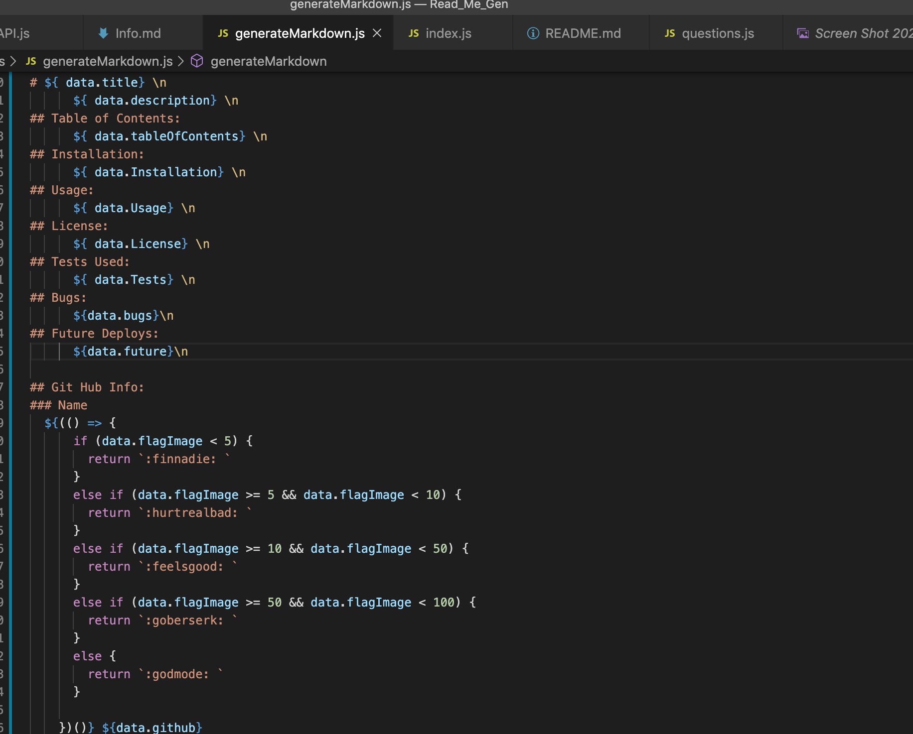

# Badges


# Read_Me_Generator 

      This is a Read Me generator that runs in terminal, and allows you to create a great looking md file with low effort! 

## Table of Contents:
    * Node JS and My Thought Process 
    * Pictures and Descriptions
    * Function Video 


## Node JS and My Thought Process 

    This ReadMe generator was very fun to make, and allowed me to really dig into asynchronous methods and their paths. I dislike crowded code, so I first made modules for each page based off of the main objectives of the assignment. I knew that I would need a list of questions, a write file method that includes a string interpolation for the ReadMe, and an axios call for the API in order to obtain the user’s git hub information. Each of these objectives have their own page, which made my index.js page much more concise.  Each page has its own method, that uses information from user’s input through inquire. Please see my photos for more details on each page. 

## Pictures and Descriptions 


``` API module ```


``` Main Index ```



``` Interpolation for Read ME on Generate Markdown Module```


``` Seperate Questions Module ```


``` A Screenshot of a basic generated ReadMe file``` 


``` Photo of the writeme method on the Generate Markdown Module ```


## Function Video 


## Installation
      This  uses Inquier and Axios, but you should just be able to run NPM Install 

## Usage
      Users can feel free to put their items in, and make a basic template for thir readme file in their bash/terminal.  

## License:
      1.0.0 

## Tests Used:
      none, but maybe soon! 

## Contribution:
      Feel free to email me, and ask for permission. 

## Bugs:
      You cannot skip either GitHub line, as the axios catch error did not work as intended. Also, you cannot enter more than one contributor at this point.

## Future Deploys:
      I would like to move ask to the questions page, as i know it is possible, and i feel like i came very close. 

      I would also like to make the applciation take in multiple names for contributors. I think it would be a forEach... but i am unsure. 


## Git Hub Info:
### Name
  :feelsgood:  ErikDono
### Picture:
 

### Email:
      erik.dono@gmail.com 

        